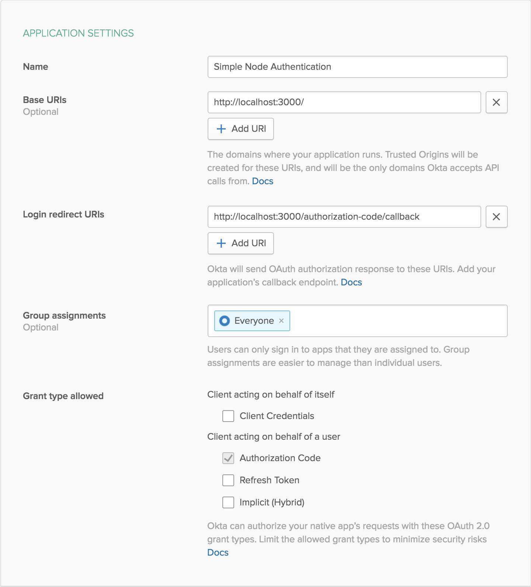

# Node Express Application with Okta Authentication

This example shows how to create a website in Node and Express that uses Okta for authentication. The application was bootstrapped with [Express Generator](https://expressjs.com/en/starter/generator.html). You can see it online at <https://okta-node-express-example.herokuapp.com>.

Please read [Simple Node Authentication](https://developer.okta.com/blog/2018/04/24/simple-node-authentication) to see how this application was created.

## Getting Started

To install this example application, run the following commands:

```bash
git clone git@github.com:oktadeveloper/okta-node-express-example.git
cd okta-node-express-example
```

This will get a copy of the project install locally. You will need to set up some environment variables before the app will run properly.

To integrate Okta's Identity Platform for user authentication, you'll first need to:

* [Sign up for a free Okta Developer account](https://www.okta.com/developer/signup/)
* You will get a URL similar to `https://dev-123456.oktapreview.com`.
  * Save this URL for later
  * You will also use this URL to login to your Okta account

You will need to create an application in Okta:

* Log in to your Okta account, then navigate to **Applications** and click the **Add Application** button
* Select **Web** and click **Next**
* Give your application a name (e.g. "Simple Node Authentication")
* Change the **Base URI** to `http://localhost:3000` and the **Login redirect URI** to `http://localhost:3000/authorization-code/callback`, then click **Done**
* Save your **client ID** and **client secret** for later

Your Okta application should have settings similar to the following:



You will also need an API token:

* Log in to your Okta account, then navigate to **API > Tokens** and click the **Create Token** button
* Enter a name that will help you remember what this is used for (e.g. "registration")
* Save the provided **token value** for later
  * This will only be displayed once. If you lose it, you will need to create another API token

Now create a file called `.env` in the project root and add the following variables, replacing the values with your own from the previous steps.

```bash
HOST_URL=http://localhost:3000
ORG_URL=https://dev-123456.oktapreview.com
CLIENT_ID=okta-application-client-id
CLIENT_SECRET=okta-application-client-secret
REGISTRATION_TOKEN=okta-api-token
APP_SECRET=something-random
```

One way to get a random `APP_SECRET` is to use the following command line, which will generate a random value and add it to your `.env` file.

```bash
echo "APP_SECRET=`openssl rand -base64 32`" >> .env
```

Now run the application:

```bash
npm install
npm start
```

If you want to run the application in development mode so that any changes you make automatically restart the web server, instead of `npm start` use the command `npm run dev`.

## Links

Here are some links that were helpful in the creation of this example:

* Libraries
  * [Okta OpenID Connect Middleware](https://github.com/okta/okta-oidc-js/tree/master/packages/oidc-middleware)
  * [Okta Node SDK](https://github.com/okta/okta-sdk-nodejs)
  * [Express](https://github.com/expressjs/express)
* Tools
  * [Express Application Generator](https://expressjs.com/en/starter/generator.html)
* Blogs
  * [Build User Registration with Node, React, and Okta](https://developer.okta.com/blog/2018/02/06/build-user-registration-with-node-react-and-okta)
  * [Build a Basic CRUD App with Vue.js and Node](https://developer.okta.com/blog/2018/02/15/build-crud-app-vuejs-node)

## Help

Please post any questions as comments on the [blog post](https://developer.okta.com/blog/2018/04/24/simple-node-authentication), or visit our [Okta Developer Forums](https://devforum.okta.com/). You can also email [developers@okta.com](mailto:developers@okta.com) if would like to create a support ticket.

## License

Apache 2.0, see [LICENSE](LICENSE).
